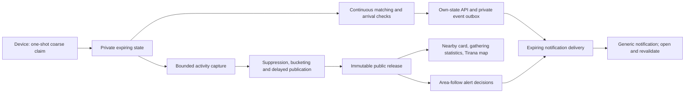

# Plan: complete the four activity journeys

Status: implementation authorized, 2026-09-13; updated by decision 0007. This document adds detail to
milestones 09/10 and their relevant hardening work; it does not mark them implemented.
The current evidence remains in FUNCTIONALITY_STATUS.md. Existing implementation
authorization and latest user direction govern work. Inference limitations are
accepted and documented; they do not block implementation.

## 1. Intended experience

| User journey | Result to implement |
| --- | --- |
| First visit → JAM GATI | Keep the willingness confirmation and easy cancellation. Add a nearby published-area card, for example **50+ GATI**, with its map area and observation time. Show a neutral unavailable/suppressed state when no count can be published. |
| Threshold → decision | Keep continuous matching and **JEMI GATI → PO, PO SHKOJ / JO TANI**. Add reliable server-side event discovery and optional background notification delivery. JO TANI declines this gathering while preserving willingness; cancellation stays separate. |
| Going → JAM KËTU → ongoing statistics | Keep the fresh device fix, destination-cell/nonce/deadline checks and temporary arrival. Show published approximate going and fresh-arrival counts on the gathering card before and after arrival. Personal state updates immediately; public numbers update on their release schedule. |
| Tirana activity map | Keep a city map visible across the willingness/going/arrival screens. Add published willingness areas and eligible gatherings within the same public cells with shared statistics, timestamps and a late-join action. A shaded-area layer supplies the initial heatmap-style view. |

All product copy remains Albanian. Suggested labels: **GATI afër teje**,
**Kanë zgjedhur të shkojnë: 50+**, **Kanë konfirmuar mbërritjen: 20+**,
**Përditësuar në …**. Final wording must explain that these are recent temporary
signals/claims, not verified unique humans. Never show 0 for a suppressed count.
“No published data” must not imply that nobody is there.

No account, manual participant location, continuous tracking, social feature or
personal history is added. Device-originated private matching remains on **100 m
cells**, maximum reported error **50 m**, with the existing **30/20** activation/
arrival thresholds and **30-minute** minimum availability.

## 2. Public count contract — settle before building screens

### Meaning of the three statistics

- **Willingness:** active, unexpired willingness credentials in one fixed public
  area, including credentials currently invited, going or here. Count the current
  session once, not button presses, requests, invitations or cumulative visits.
  Use the session's submitted area; this map does not track people during travel.
- **Going:** credentials currently admitted to a particular gathering with going
  intent, including those with fresh arrival confirmation. Decline, cancellation,
  switching gathering or expiry removes the relevant current contribution.
- **Here:** the subset of going credentials with an accepted, still-fresh arrival
  claim for that gathering. Retraction/freshness expiry removes this contribution;
  retraction alone does not remove going intent.

Going and here overlap: **never add their labels together**. The UI must say that
arrivals are included among those who chose to go. These are measurements sampled
for a release, not instantaneous raw counters or a lifetime attendance history.

### Area and time resolution

Keep public geography separate from private matching geography. Use a fixed,
nonoverlapping **1,000 m public area grid** anchored to the existing Tirana bounds.
Map each 100 m input cell into one public area. No dynamic merging, zoom-dependent
recounting, parent totals, arbitrary circles or participant-radius count endpoints.
The nearby card selects the user's containing public area locally from the common
Tirana release. Show that area's outline; do not claim it equals the travel radius.
Map browsing/following an area is not manual entry of participant location.

Retain the configured **five-minute releases with one epoch of delay**. Matching,
private JEMI GATI/JEMI KËTU and personal arrival confirmation do not wait for this.
Public figures will usually describe observations roughly **5–10 minutes earlier**,
plus bounded capture/cache/refresh time. At initial launch there may be no released
snapshot yet. A user's button press must not immediately increment the public card.

Keep the existing bucket lower bounds **20, 50, 100, 250, 500, 1000**. A released
bucket means a recent lower bound, not an exact population or a promise that it is
still present. Small/unpublishable values use the same neutral placeholder, with
no raw count, threshold distance or detailed suppression reason in any response.

### Publication policy and accepted inference limits

Decision 0007 authorizes implementation despite inferred information. Keep fixed
cells, buckets, delays and small-count suppression; do not block these features on
eliminating collusion, differencing, nested-count or origin/destination inference.
Record reproducible counterexamples as limitations, never as an anonymity pass.

For each release, count each live credential once in its origin area and at most
one gathering. Publish a gathering only when at least `minimum_count` live linked
credentials (invited, going or here) remain. Bucket going and here separately;
values below the minimum are omitted. Publish JEMI KËTU only when the sampled private
state is confirmed and the here count also reaches the public minimum. No raw
counts, exact remainders, parent totals or suppression reasons are released.
These rules deliberately retain inferential leakage from combined views and epochs.

**The public statistics API and map identify gatherings only by their containing
public cell, using the same 1,000 m grid as willingness.** Include an opaque gathering
ID, cell ID, deadline and permitted buckets/state, but no intersection ID, label,
coordinates, computed group center or displaced marker encoding the destination.
Multiple gatherings in one cell share its polygon and appear as entries in that
cell's list; do not jitter markers to suggest distinct locations. Exact crossroad
information remains in the existing private invitation/admission flow, so people
can actually attend. Map browsing alone does not fetch that private information.
An eligible participant may therefore still learn a destination through joining;
cell-only publication is not a claim of resistance to enrolled observers.

The first implementation commit supplies deterministic publication and inference
fixtures. Later capture tests cover deadlines and duplicate contributions. Public
entries use sampled state, not live per-request counts; joining always revalidates
current private state and cutoffs. Push remains **off by default, chosen explicitly
by the user**, and declining it never changes matching or access to in-app features.

## 3. Architecture and data flow

Reuse TypeScript/MapLibre, the Go API/worker codebase and memory-only Valkey. Add
small aggregate/publication and notification modules, not new hosted databases,
streaming platforms, analytics services or separate microservices.

### Capture and publication

`EligibleSnapshot` is matcher input, not an activity snapshot: it lacks complete
intent/arrival information and its live pagination must not be assumed atomic.
Add a dedicated bounded capture path covering all relevant live states and frozen
gathering metadata, with temporary in-memory deduplication and deadline validation.
Build every released metric from the same capture, not separate counters queried
by each screen. Record capture start/end; present a bounded observation interval
rather than falsely labeling a paginated read an exact instantaneous snapshot.

The implementation must explicitly test concurrent writes, cancellation, movement
between gatherings and expiry during capture. Declare a maximum capture duration
and size. Discard an incomplete/invalid capture and keep the previous still-valid
release; do not publish a partly read population or retry indefinitely. Temporary
capture rows/hashes remain private in process memory and are discarded when capture
ends; they are not a participant-history database. No public request scans them.
At 100k capacity, capture cost is a later measured gate; do not pause continuous
matching for an unbounded whole-store operation.

Use a separate publisher lease plus atomic compare-and-set on the epoch/config/map
version to prevent two replicas publishing different results for one epoch. Freeze
and stage the safe aggregate document until its scheduled release time. A retry or
restart must not amend a released epoch or reconstruct an old epoch from current
participants. If a snapshot cannot be produced, publish no invented zero snapshot.

Proposed public surface: **GET /api/activity/latest** for one bounded Tirana
snapshot, plus an immutable epoch form if needed by caching. Include release ID,
observation/release/expiry times, config/map/public-grid versions, safe area buckets
and safe gathering entries. The same entry feeds the home card and map popup.
A public gathering link resolves only information in a retained published release;
unpublished/unknown/expired IDs must not become a live existence/count oracle.
No public call receives a willingness capability or takes private cell/radius inputs.

Origin retention stays within **15 minutes from capture**, including pending release.
Bound client/CDN max-age by absolute expiry; use ETags and a short latest-pointer
cache lifetime (propose 30 seconds). Immutable content is identical for all callers.
On expiry/offline, mark data unavailable/stale and never enable offline joins or
arrivals. Do not cache authenticated responses in HTTP caches or a service worker.
External readers can retain published data indefinitely; origin TTL cannot revoke it.

### City map and admission

Use first-party road geometry and locally bundled map code. Render shaded public
polygons using released bucket categories; avoid smooth interpolation that invents
activity inside suppressed areas. Zoom changes rendering only. Provide accessible
text/cards and a layer toggle for willingness versus gatherings.

A released gathering popup shows only its public cell, deadline, last-published state
and permitted going/arrival buckets. New recipients use a deliberate join screen:
fresh device fix, availability/radius, **PO, PO SHKOJ**, then existing `/api/join`.
Existing participants reuse their session and the intent path. Opening a link, map
or notification performs no enrollment, going action or arrival. Test joining an
already JEMI KËTU gathering, cutoff rejection, stale links and lost-response retries.

### Notification discovery and delivery

Preserve foreground polling and immediate own-state responses. Currently some open
gathering offers are selected during an own-status request. Background delivery
therefore requires bounded **server-side offer discovery**, not just a push sender.
Discover invitations for eligible active sessions regardless of push opt-in; do not
make notification permission determine matching eligibility or raise priority.

Add temporary recipient indexes with explicit member deadlines and bounded cursor
fanout. Atomically record notification-worthy transitions alongside their state
change in a private outbox; delivery stays outside the matching transaction. Cover
JEMI GATI, relevant gathering updates and JEMI KËTU. Reconcile missed work after a
worker restart. Deduplicate by temporary handle/gathering/event; revalidate relevance
at send time, coalesce updates, cap retries and drop stale/expired work. Do not send
an invitation the user already declined or treat a delivery acknowledgment as going.
Outbox/fanout overload must not turn participation APIs into unbounded work queues.

Optional Web Push asks permission only after an explicit user action, and carries a
generic Albanian lock-screen message: **Ka një përditësim në GATI.** Resolve current
details after opening. Do not include private gathering IDs, location, counts or
session secrets in notification text/URLs. Public gathering references may appear
in an in-app alert only after passing the same publication rules.

A closed tab loses today's sessionStorage capability. To make an opted-in private
notification actionable after reopening, explicitly add **one expiring resume record
in IndexedDB** containing the current capability, deadline and notification handle;
no exact/coarse location history. Only enable this bounded persistence with explicit background
notification opt-in; retain the tab-only path otherwise. Store only capability hashes
server-side. Every restored record is deadline-checked and revalidated by the API;
server expiry is authoritative. Cancellation/opt-out clears the associated records
and delivery bindings. Closed clients cannot promise scheduled physical deletion;
expired state must be useless and removed on next execution. Document this change
from the current tab-only storage in a decision record and privacy data inventory.

Area follows use an independent expiring handle, initially **one public area** for
at most 24 hours. Following a map area never creates willingness or transmits a
participant position. Nearby-large alerts use only common released buckets and the
configured radius/thresholds; do not sum overlapping or suppressed counts. Initially
match a qualifying released area within that distance, not an exact circular total.
Changing the followed area replaces it; retain no trail of past follows. Do not reuse
handles automatically across sessions or extend them without an explicit action.

Push endpoints and keys are identifying delivery data: separate restricted storage,
no logs/backups, TTL ≤ session expiry or explicit follow deadline, immediate logical
unsubscribe, expired-index cleanup, removal on provider 404/410. Treat browser
expirationTime as advisory: the application must enforce its own bound even when
it is null. Attempt browser unsubscribe when possible; provider retention is outside
GATI's erasure claim. Provider connections are an optional privacy tradeoff.

Use standards-based encrypted Web Push through one reviewed pinned Go dependency;
do not implement cryptography or use a tracking SDK. Protect endpoint registration
and outbound requests against SSRF: HTTPS, bounded provider/host policy, no private/
loopback/metadata addresses or redirects, DNS-rebinding checks, bounded body/time/
concurrency. Generate application VAPID keys locally and keep private keys in the
existing ignored secret mechanism. No user email/phone is collected for delivery.

## 4. Configuration additions and lifecycles

Keep current functional values unless a failing acceptance case motivates a visible
change. New names below are proposals, not accepted schema fields yet. Add them in
one schema revision, update canonical config/hash/client compatibility and docs.

| Setting | Proposed value / constraint |
| --- | --- |
| `public_activity.area_size_meters` | 1000; fixed reviewed public grid, at least 1000 and aligned with the configured private grid |
| Existing public minimum / buckets | 20 / [20,50,100,250,500,1000]; common across cards/map/alerts, subject to the documented publication policy |
| Existing release / delay / retention | 300 s / 1 epoch / 15 min; retention includes staging and cache lifetime |
| `public_activity.capture_max_seconds` | 30; measured deadline, below release interval; discard incomplete captures |
| `public_activity.max_snapshot_bytes` | Initial 1,000,000 byte uncompressed cap; reject incomplete output, measure actual Tirana payload |
| Existing foreground poll | 30 s with existing jitter/backoff; live state distinct from public release timing |
| Existing push interval / hourly cap | 300 s / 6; coalesced events, no exactly-once external-delivery promise |
| Existing notification queue TTL | 300 s, also capped by recipient/session/gathering relevance deadline |
| Existing nearby thresholds / radius | 50 willingness / 50 arrival / 5 km; thresholds must be released bucket boundaries |
| Existing area-follow maximum | 24 h; one public area per temporary handle for this slice |
| New notification work limits | Explicit per-step recipient batch, total handles/queue cap and retry cap; start batch 100, max 3 retries, size total caps against existing signal limit and measured memory |

Do not add a secret environment-only behavior override. Fake delivery is compiled/
configured only in the isolated simulation environment and rejected by production
artifacts. Operational keys and provider credentials stay outside functional YAML.

New private capture copies, recipient membership, outbox/dedup entries, subscriptions,
resume records and indexes each need a documented expiry/cleanup owner. Participant-
linked metadata cannot outlive its session/gathering. A safe published snapshot can
outlive a constituent participant within its declared public retention; it must
contain no credential/member link. Cleanup tests must exercise index members, not
only key TTL. No participant snapshot backups or durable event log is introduced.

## 5. Commit sequence and acceptance checks

Each row is a coherent milestone/commit target; split a large row into smaller
reviewable commits while retaining its acceptance gate. Update PROGRESS, API,
STORAGE, threat model and tests with implementation, not speculative pass claims.

| # | Commit target | Required evidence before calling it complete |
| --- | --- | --- |
| 1 | `design: define public activity and notification contracts` | Exact W/going/here semantics, fixed public grid, observation/release clocks, retention, proposed schema and API fixtures. Adversarial examples for nested counts, 19/20, 49/50, temporal transitions, colluding inputs and origin/destination correlation. Record bounded claims and unsafe cases. |
| 2 | `feat: publish bounded delayed activity snapshots` | Dedicated all-state capture, deadline/dedup handling, publication policy, fenced immutable publication, cached API, TTL and invalid/absent-data behavior. Real-store race/restart tests; no individual fields or per-request participant scan. |
| 3 | `feat: show nearby and gathering activity statistics` | Nearby card after JAM GATI; common going/here bucket cards in invited/going/here states; suppressed/loading/offline/error behavior, timestamp and overlapping-count explanation. Browser/network assertions; same release gives identical values across views. |
| 4 | `feat: map public activity and join released gatherings` | Always-visible Tirana map, shaded willingness areas, cell-only gathering entries, accessible cards and public-link join flow. First-party requests only, no markers for hidden groups, no counts altered by zoom, fresh location and cutoff/replay/late-arrival checks. |
| 5 | `feat: discover invitation events and queue bounded notifications` | Background eligible users receive server-discovered events without polling; matching unaffected by permission. Atomic outbox, recipient cleanup, crash/retry recovery, dedup, rate limits and stale/declined-event removal. Local fake sink reports events without sensitive logs. |
| 6 | `feat: add optional PWA notification lifecycle` | Manifest/first-party service worker, explicit permission UI, bounded opt-in resume record, cancel/expiry/opt-out cleanup. Never cache private API data; no automatic offline participation. Browser tests cover granted/denied/unsupported/closed-and-reopened cases. |
| 7 | `feat: deliver encrypted expiring Web Push updates` | Reviewed dependency, private VAPID keys, generic payloads, SSRF constraints, endpoint removal, TTL/retry caps. Deterministic fake-transport tests plus separately recorded real browser/device smoke when available; missing interoperability checks stay unverified. |
| 8 | `feat: follow public areas and notify on released activity` | Independent optional area handle, current published thresholds, no willingness side effect, bounded follow expiry/replacement and flood dedup. Alert links resolve released data and permit late join only after explicit valid action. |
| 9 | `test: simulate complete activity and notification journeys` | Extend 3,000-person Tirana runs to consume the real published API/fake delivery rather than inject every discovered gathering. Three seeds, sparse/dense/churn/low-follow-through, all four browser journeys and adversarial compositions; report accepted/rejected/late/missed/stale deliveries and release ages. |
| 10 | `docs: publish activity feature verification evidence` | Re-run relevant local checks; committed schema/data-flow/retention/examples and reviewed simulation results. Distinguish implemented/tested, accepted inference limitations and suppressed values, untested real push and remaining deployment/100k gates. Reproducible local commands from a clean checkout. |

Unit fixtures must test outcomes rather than mirror the publisher. Include a small
independent exact synthetic oracle to check count definitions against controlled
session states. Tests must prove that repeated creates/arrival replays add nothing,
expiry/decline/retraction affect the right categories, late joins do not move/end-
extend a gathering, and one participant cannot be counted twice in a captured view.

## 6. Local test and release strategy

Use current Docker/Go/Node/Playwright tooling and archived Tirana map. No new paid
service or credentials are needed for aggregate publication, map UI, the event
outbox or deterministic push simulations. Extend existing make targets/scripts;
name any new commands as planned until they actually exist.

Keep fake clocks and delivery controls out of production. Functional simulations
advance through public epochs as well as matching/arrival deadlines; fake time does
not bypass real rate budgets. The public map/replay must fetch the production-shaped
published contract; retain a separately labelled synthetic truth view for debugging.
A coarse API actor simulation does not replace the mocked-device browser tests.

Browser acceptance journeys:

1. Fresh visitor creates willingness, sees JAM GATI and a released nearby bucket;
   a lone visitor sees no invented zero or exposed small count. Cancellation is easy.
2. Continuous activation reaches 30 compatible willing signals; visible client
   sees JEMI GATI and a permitted background client gets a generic update. Opening
   it restores only an unexpired session; JO TANI retains willingness.
3. Going exposes JAM KËTU; wrong cells/stale fixes fail; correct fresh claims/replays
   count once. Cards share released going/here buckets before/after arrival and
   handle arrival freshness loss without claiming continuous physical presence.
4. Tirana map shows only publishable areas/gatherings. Popup counts equal the other
   cards for that release; opening never enrolls. A newcomer can join after
   JEMI KËTU, while an expired/cutoff link fails without an orphan new session.

Add aggregate-fetch burst tests against a frozen release to demonstrate that reads
are independent of participant-store scans. Keep them separate from the still-
required full **100k active-signal** matching/arrival benchmark and edge DoS exercise.

Real Web Push needs permission, browser/provider support and a secure origin. A
service worker can receive messages while the page is inactive; delivery may be
restricted or delayed. Test actual supported browsers separately from the fake sink.
See the [W3C Push API](https://www.w3.org/TR/push-api/). On iOS/iPadOS, plan an explicit
Home Screen web-app test on a real device, as described in
[Apple's Web Push guidance](https://developer.apple.com/documentation/usernotifications/sending-web-push-notifications-in-web-apps-and-browsers).
No silent push or guaranteed delivery deadline is assumed.

Keep real device/HTTPS/provider setup as a final interoperability step. Complete
local code and fake-delivery evidence first; request only the concrete missing
certificate/device/domain or explicit real-delivery test input at that point.
Do not ask for passwords in chat, publish the app, or push repository changes as
part of local feature work.

## 7. Effort and boundaries

Planning estimate for one developer: **75–125 focused hours**, roughly **2–4 working
weeks**, plus any capture or device/provider troubleshooting exposed
by the acceptance gates. Commits 1–4 should provide the first complete local
statistics/map slice in approximately **35–55 hours**. These are development effort
estimates, not promises about coding-agent wall time or a security certification.
The largest uncertainties are cross-surface inference, coherent bounded capture,
background invitation discovery, and the closed-tab notification/resume lifecycle.

The short aggregate history/daily-summary feature in the broader recap, 100k
benchmark, production edge/host hardening and independently verified deployment
remain separately tracked milestones. They are not required to claim these four
specific UI journeys implemented, but still gate the broader MVP/public release.
No omitted numeric/notification feature should be labeled complete merely because
its state transition or fake transport passed. Record the remaining gap explicitly.
