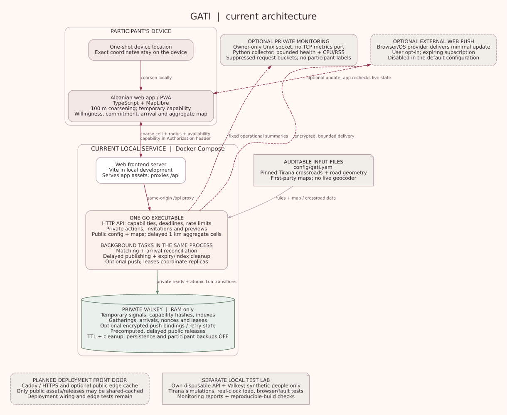

# GATI architecture and one-million-signal assessment

Update 2026-09-14: [decision 0011](decisions/0011-incremental-matching-working-set.md) replaces growing-OFFSET traversal and introduces changed-cell reads plus a bounded private matching working set. [Repeated benchmarks and monitored 100k comparison](reports/scaling-2026-09-14.md) measure both speedups and increased cache RSS. [Production roles and topology](DEPLOYMENT.md) now support built Caddy assets, two API-only replicas and a dedicated worker. The original measurements, diagram and 1M extrapolations below remain historical evidence, not measurements of the revised code. A 1M component benchmark is not a 1M-user capacity test.

Reviewed 2026-09-13 against source at 9e2bd39 and the recorded monitored 100k runs.
This document describes implementation, distinguishes planned deployment components,
and provides an estimate. No 1M benchmark or configuration change was performed.



[PDF for sharing](diagrams/gati-architecture.pdf) · [editable Graphviz source](diagrams/gati-architecture.dot)

## Can the current system handle one million signals?

**Not with the current configuration, and not yet demonstrated by testing.** The
architecture could plausibly be extended to this scale, but raising one setting
would not establish acceptable matching, publication, arrival or notification latency.

- `limits.max_active_signals` is **150,000**. Both willingness creation and direct
  late-join creation enforce this limit. Expired index members awaiting cleanup can
  also consume admission capacity. The configuration validator's general integer
  ceiling is 1,000,000; the load harness currently permits only up to 100,000.
- `global_writes_per_second` is **500**. One million foreground clients polling
  every 30 seconds implies approximately **33,333 status requests/s**, versus the
  measured 3,334/s at 100k. Filling one million signals at 500 creations/s would take
  33m20s before other writes; with every signal lasting 30 minutes, the theoretical
  steady-state ceiling is 900,000 even without any other writes or rejection. A 1M
  test needs an intentional arrival-rate/lifetime model, not just more records.
- The matching engine elects one writer using a store lease. It loads the live
  population into Go memory and performs sorting/candidate work. Adding API replicas
  does not automatically partition that matching workload or the shared store.
- `EligibleSnapshot` pages `ZRANGEBYSCORE` with increasing offsets and 1,000-record
  pages. Valkey documents that a large offset requires traversal through skipped
  entries ([command documentation](https://valkey.io/commands/zrangebyscore/)). For
  this particular paging pattern, summing those offsets gives approximately
  N²/(2 × page size) skipped-entry work across a complete sweep: going from 100k
  to 1M can increase **this traversal component** about 100-fold, not ten-fold.
  This is a code/algorithm inference, not a measured 1M timing result.
- Public capture also traverses the population, retaining temporary participant
  records and a deduplication set before producing safe aggregates. It has a
  30-second capture deadline. The matching and capture allocations can overlap.
- Background offers process at most 100 candidates per eligible sweep by default.
  Foreground requests can also discover offers, so this is not a limit on all
  invitations; it is a background backlog concern. Push uses bounded batches and
  eight concurrent deliveries per process when enabled. Cleanup normally runs
  every ten seconds and processes at most ten 1,000-entry batches per tick; a mass
  expiry requires separate cleanup-lag measurement even though reads reject expired
  credentials immediately.
- Local Compose currently sets Valkey `maxmemory` to **128 MiB** inside a **256 MiB**
  container. The 100k test lab used a 512 MiB store limit instead. Those are different
  environments; the lab result does not size the ordinary Compose store for 1M.

The first changes to investigate would be resumable scans without growing offsets,
incremental work over changed geographic areas, bounded/streamed aggregation where
privacy semantics permit, and measured backlog control. These can remain in the
existing Go/Valkey design. Geographic partitioning would be a later measured choice
and must preserve matching across boundaries. Neither identity collection nor
larger public disclosure is needed to investigate scale.

A useful next capacity test would step through 250k, 500k and 1M; combine status,
public reads and writes; include many gatherings, arrival/late-admission churn and
optional fake-provider fanout; and measure actual matching, publication and cleanup
lag alongside CPU/RSS. A remote generator and separately sized server remain needed
for the reference-host claim.

## Memory estimate

Measured process resident memory (RSS), sampled every five seconds:

| Component | Uniform 100k peak | Hotspot 100k peak | Rough planning allowance at 1M |
| --- | ---: | ---: | ---: |
| Go API and its background tasks, one process | 492.18 MiB | 506.37 MiB | 2–4 GiB |
| Valkey process | 88.72 MiB | 90.22 MiB | 0.8–1.5 GiB |
| Combined core processes | about 581 MiB | about 597 MiB | **about 3–6 GiB** |

The 1M column is an **unvalidated estimate, not a safe upper bound or deployment
sizing promise**. It assumes the same Tirana map, 100-metre cells, one Go process,
a workload dominated by willingness, and push disabled. It excludes OS memory,
frontend/edge infrastructure, test generators, browser/device memory and deployment
headroom. Many arrival/decline records, subscriptions, retries, more map coverage or
additional replicas can increase memory substantially.

The estimate separates fixed costs from growing state:

- First monitored samples were about 259–261 MiB for Go and 9–10 MiB for Valkey,
  before the population ramp. The Go process precomputes a crossroad reachability
  index for every supported cell/radius combination. Its cost grows with map
  coverage/resolution/radius choices, not directly with the number of participants.
  Startup/warmup and garbage collection also affect observed RSS.
- A simple Valkey projection is `10 + 10 × (90 − 10) ≈ 810 MiB`, before extra
  headroom and richer participant state. The table allows additional uncertainty.
- A deliberately simple Go projection using first-sample baseline and peak growth
  is `260 + 10 × (506 − 260) ≈ 2,720 MiB`, around 2.7 GiB. It is not a fitted
  per-signal cost: intermediate samples show substantial warmup, transient snapshots,
  sorting and garbage-collector effects. Thus the much less certain 2–4 GiB allowance.
- Combining separately sampled process peaks is conservative; it is not a claim
  that both peaks occurred at exactly the same instant. Sub-five-second peaks can
  also be missed. Extra replicas repeat the map index and parts of the working set.

The original evidence is in [the automated test report](reports/predeployment-automation.md).
Only a larger measured run with representative transitions can turn these estimates
into reliable operating requirements.

## How the system works

### Client: Albanian browser app / PWA

TypeScript implements the stateful interface and MapLibre draws the Tirana map.
There are no accounts. The client obtains a one-shot location fix, checks its reported
age/accuracy, converts it to a 100-metre cell locally, and sends the cell, chosen
travel radius and availability. Exact participant coordinates are not sent to the
server. Device location can still be inaccurate or spoofed.

The browser creates a random temporary capability and sends it in the Authorization
header. Normal reload recovery uses sessionStorage; optional push/resume also uses
an expiring IndexedDB record. The client checks absolute deadlines when reopening.
Foreground state polling is currently every 30 seconds. Preview, commitment,
arrival and cancellation are separate actions. Willingness is never automatic
attendance. The UI displays only released aggregate counts on the public map.

### Web serving and deployment boundary

The current Compose stack contains a Vite development web server, a Go API and
Valkey. Vite serves the frontend and proxies `/api` to Go. A compiled frontend bundle
also exists for eventual static serving. Caddy/HTTPS and an optional public CDN/cache
are planned deployment components; there is no implemented production Caddy stack
in the current repository. Authenticated responses must never enter shared caches.
The diagram's planned deployment box is intentionally separate from the working
local stack.

### Server: one Go codebase and executable

The HTTP API validates capability ownership, bodies, rate budgets, geography,
reachability and server deadlines. It processes willingness, invitations, previews,
late joins, commitment, arrival nonces, arrival confirmation and cancellation. It
also serves canonical public configuration, first-party road geometry and precomputed
aggregate releases.

Background tasks run in the same executable: continuous matching, arrival-presence
reconciliation, aggregate capture/publication, cleanup and optional push delivery.
Matching selects a common reachable mapped crossroad near the coarse group's center.
An activated destination and deadline remain fixed. Current thresholds are 30
compatible willingness signals and 20 accepted arrivals, each with ten-second
stability. Store leases coordinate competing processes; atomic store transitions
check conflicts/replays. The HTTP tier can have replicas, but the current deployment
has one API service and matching has one elected writer.

### Database: private, temporary Valkey

Valkey is the live state store, not a durable participant database. It holds coarse
signal records, hashed capabilities and tombstones, time/geographic indexes, gathering
state, arrivals, nonces, leases, rate-limit state and optional encrypted push bindings
and retry state. Lua transitions keep multi-key changes atomic and reject expired or
replayed actions. Native TTLs and bounded cleanup handle lifetimes/index membership.

The configured store has persistence disabled and no participant backups. Restarting
it loses temporary sessions. It is isolated on Compose's private backend network and
uses restricted credentials mounted from local secret files. The API still sees
necessary temporary state in memory; this is not end-to-end secrecy from a privileged
server operator.

Public aggregates are also staged in Valkey. They use one-kilometre public cells,
suppression below 20 and bucketed counts, with five-minute capture epochs and delayed
publication. Button-to-public visibility can approach 15 minutes. Public API reads
serve these releases rather than calculate arbitrary live individual-count queries.
The browser never connects directly to Valkey.

### Other components

- **Map/config inputs:** versioned OpenStreetMap-derived Tirana road and crossroad
  files, plus typed `config/gati.yaml`. They are local/first-party inputs with
  attribution and hashes; no live geocoder or tracking map vendor is required.
- **Optional Web Push:** encrypted, bounded delivery through a browser/OS provider.
  The provider receives only the necessary transport data; notifications show a
  minimal update, then the app checks current private state. Push is disabled by
  default and requires explicit opt-in. Provider metadata exposure remains a tradeoff.
- **Operational monitoring:** optional owner-only Unix socket and a first-party
  Python collector. It stores bounded, allowlisted health/resource summaries and
  suppressed request buckets, without participant/cell labels or individual traces.
  It is operational monitoring, not a participant analytics funnel.
- **Test/build tools:** disposable synthetic labs, seeded Tirana simulations,
  real-clock load, browser/fault tests, reports and clean-build comparison. These
  operate on their own stores and cannot contribute fake participants to the
  ordinary application. Production builds exclude simulation controls.

GATI enables coordination without an organizer, but the implemented software is a
**centrally hosted service**, not a peer-to-peer or federated network. Publishing its
source, configuration and reproducible artifacts improves auditability; it does not
prove that an arbitrary remote operator runs those artifacts unchanged.

## Audit pointers and diagram regeneration

- [Client location handling](../web/src/location.ts), [session lifecycle](../web/src/session.ts)
- [API routes](../internal/httpapi/server.go), [process/worker wiring](../cmd/gati/main.go)
- [Matching loop](../internal/worker/engine.go), [snapshot scan](../internal/store/gatherings.go), [planner](../internal/matching/planner.go)
- [Aggregate capture](../internal/store/activity.go), [reachability index](../internal/geography/index.go)
- [Functional settings](../config/gati.yaml), [local stack](../compose.yaml), [store controls](../deploy/valkey.dev.conf)
- [Privacy/threat model](THREAT_MODEL.md), [monitoring](MONITORING.md)

The diagram uses Graphviz, a code-native vector tool. Recreate with:

```sh
dot -Tsvg docs/diagrams/gati-architecture.dot -o docs/diagrams/gati-architecture.svg
dot -Tpdf docs/diagrams/gati-architecture.dot -o docs/diagrams/gati-architecture.pdf
```

Rendered and visually checked with Graphviz 2.43.0. SVG and PDF can be enlarged
without losing clarity; DOT is the editable source. No app dependency was added.
