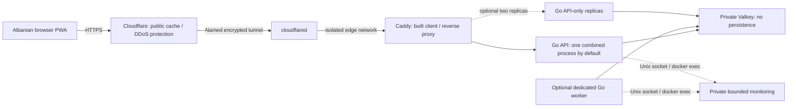

# Production preparation and operator runbook

The production images, private container networks, Caddy proxy, process roles and
local rehearsal are implemented. No public deployment or Cloudflare account has
been created. Start with a capped, monitored pilot after the remaining host/edge
checks; neither the laptop benchmarks nor two API replicas certify 1M capacity.
See [measured performance and memory tradeoffs](reports/scaling-2026-09-14.md).

## Topology and local verification



Default: one combined Go API/worker, Valkey, Caddy and the optional tunnel.
`--replicas 2` selects API-only processes plus one dedicated worker. API replicas
refresh a bounded destination view; they do not each retain the matching population
or acquire matching leadership. Caddy uses Docker DNS and needs no sticky sessions.
An API failure can cause a brief 502 while the five-second DNS view updates; clients
already support safe retries. There is one matching owner and one Valkey. Additional
APIs do not multiply matching throughput or protect against host/store loss.

```sh
source scripts/env.sh
make production-build
make test-deployment OUTPUT=reports/local/deployment-check
```

The rehearsal creates an isolated disposable stack with production images, two APIs,
a worker and Caddy. A **test-only connector**, absent from production artifacts,
publishes one random loopback port. It checks real activation/arrival/retry behavior,
network rate budgets, forged headers, private-cache bypass, actual store settings,
private monitoring and browser operation under production CSP. No real tunnel,
public hostname, provider request or participant data is involved. Fixed reserved
subnets are 172.30.10.0/24 and 172.30.11.0/24; Docker refuses overlapping existing
networks. Review host routing too before deployment. Do not run two such stacks
at once on one Docker daemon.

Production publishes **no host ports**. Caddy accepts requests only from the exact
connector address, and the Go API accepts its client-IP header only from Caddy's
exact address. Loopback health probes have a narrowly scoped exception. Dynamic
addresses come from a separate IP range, preventing collisions with reserved proxy
addresses. CF-Connecting-IP is copied before forwarding headers are removed; the
API validates and canonicalizes that value before rotating network-HMAC budgets.
The tunnel/Cloudflare account is a trusted ingress boundary: do not attach arbitrary
containers, extra public tunnel routes or unreviewed Workers to it.

Container controls: unprivileged users, read-only roots, all capabilities dropped,
no-new-privileges, no container logs/core dumps/swap, private RAM-backed temporary
paths and bounded CPU/memory. Caddy's unnecessary executable file capability is
removed during build. Production Valkey uses 512 MiB maxmemory/noeviction inside a
768 MiB container; each Go process has a 1.5 GiB hard limit and 1 GiB GC target.
These are initial resource bounds, not promised capacity. Live participant data
is lost on store restart, by design.

## Prepare one verifiable release

Commit intended changes first; untracked local files and secrets are not exported.
Choose a real hostname when preparing the eventual public release. `localhost` is
the default for local rehearsals.

```sh
source scripts/env.sh
python3 scripts/release.py prepare --release /opt/gati/releases/RELEASE --public-host gati.example
python3 scripts/release.py verify --release /opt/gati/releases/RELEASE
make reproduce-build OUTPUT=reports/local/release-reproduction
```

Use a writable project-local directory instead of /opt when rehearsing locally.
`prepare` exports the exact Git commit, builds the API and web images, records image
IDs, source/config/file/browser-asset SHA256 values, and saves the images for offline
transfer. `release.json` and `release.sha256` are public audit material; retain their
hash through an independent channel. Release tags are checked against recorded image
IDs before use. Upstream images are pinned and included in the image archive.
`build.log` is diagnostic output, excluded from the file manifest; review it before
publication. Source/dependency/map licenses remain in the exported repository.

`reproduce-build` compares the native API and browser assets from two clean exports
with independent compilation caches on the same host/toolchain. It does not prove
cross-platform reproducibility, identical OCI metadata or a remote operator's honesty.
Use `python3 scripts/verify-public.py --release /PATH/RELEASE --url https://gati.example`
to compare served browser bytes and the advertised config hash against a separately
obtained release. Disable content rewriting at the edge. A privileged
reviewer must separately inspect running image IDs, mounts, configuration, host
controls and ingress rules. There is no pretend backend attestation endpoint.

## Host setup and activation

Before provisioning: choose the VPS/domain and accept the provider visibility
boundary in [deployment preparation](DEPLOYMENT_PREPARATION.md). Public operator
pseudonymity is different from anonymous billing. Review Git author/contact metadata
before publishing the source. Accounts, purchases, remote pushes, SSH access and
public deployment still need the user's explicit authorization.

On the authorized host: install pinned Docker/Compose prerequisites, use SSH keys
through a restricted management path, apply updates, disable swap/hibernation and
RAM snapshots/core dumps, and keep inbound web/store ports closed. Do not disable
swap on a developer's workstation merely to pass deployment checks.

```sh
python3 scripts/release.py preflight
python3 scripts/release.py up --release /opt/gati/releases/RELEASE
python3 scripts/release.py verify --release /opt/gati/releases/RELEASE --running
```

Without `--edge`, activation starts only the private stack. Operational secrets live
in `/opt/gati/releases/.gati-production-runtime`, mode 0700, shared by releases under
that parent directory. Store configuration and credential mount paths remain stable
across releases, avoiding an unnecessary Valkey restart. Do not edit immutable
release files in place. Build a new release for functional settings changes.

Create a **named, account-managed tunnel** with public hostname gati.example and
service `http://web:8080`. Set a final unmatched-hostname rule to 404. Provision the
connector token privately as `.gati-production-runtime/tunnel-token`; it must be
readable by the container UID but protected by the 0700 host parent. Never paste
tokens into chat, commit them or put them on command lines. Quick tunnels are not
the supported production path. Then, only after authorization and edge review:

```sh
python3 scripts/release.py up --release /opt/gati/releases/RELEASE --edge
python3 scripts/release.py verify --release /opt/gati/releases/RELEASE --running --edge
```

For two APIs, add `--replicas 2` to activation and verification. Changing back to one
requires explicitly stopping the former dedicated worker; do not leave an unintended
old worker running. A host swap check intentionally blocks `--edge`; runtime-only
container validation does not certify the host. Host preflight also lists manual
checks that automation cannot prove.

## Cloudflare edge checklist and rule template

Configure these on the actual zone and verify real responses before a pilot. This
repository does not apply account rules without credentials or pretend a local
proxy test establishes Cloudflare behavior.

1. Enforce HTTPS; keep the connector's final hop on the isolated container network.
   Keep application/API/Valkey origins inaccessible directly from the public Internet.
2. Cache only `GET`/`HEAD` requests without Authorization or Cookie headers and with
   an empty query string. Allowlist `/assets/*` and `/api/map/roads`; optionally
   `/api/activity/latest` with origin cache-control respected. Bypass every other
   API route, mutation, credential-bearing request and query-bearing request.
3. Activity responses use `public, max-age=30, must-revalidate`, bounded by remaining
   release validity; absent/expired releases use no-store. Never override that TTL,
   enable stale-if-error/Always Online for API responses, or cache 204/error responses.
   JSON needs explicit eligibility rules; do not assume default JSON caching.
4. Use network-layer/edge DDoS protections and conservative API-path rate rules;
   retain precise shared application budgets. Review NAT/mobile-carrier behavior.
   Avoid adding tracking/challenge SDKs to the client. Do not turn on analytics,
   session replay, injected scripts, content rewriting or access-log exports.
5. Verify cache MISS/HIT/expiry, credential/query bypass, spoof resistance, HTTPS
   location permission, edge error behavior, cold starts, readiness and tunnel
   recovery. A real Cloudflare load test must be explicitly authorized and comply
   with provider terms; the local suite does not test volumetric DDoS resistance.

Cloudflare terminates browser HTTPS and can see IPs, timing, coarse-cell requests
and expiring capabilities. Provider security retention is outside GATI's TTL.
The hostname/tunnel does not conceal the host from providers or protect live RAM
from privileged administrators. See the [threat model](THREAT_MODEL.md).

## Monitoring, optional push and rollback

Find the API/worker container name with Docker, then run the bounded collector:

```sh
python3 scripts/monitor.py --container gati-production-api-1 --socket /run/ops/gati.sock --output /PRIVATE/monitor-api.json
```

Use a private RAM-backed output directory in production; one bounded file per
process, no event logs. Alert on file freshness, unavailable monitors, errors,
worker/deadline lag and sustained released latency/failure buckets. See
[monitoring semantics](MONITORING.md). Notification routing needs an operator-chosen
private destination; the collector currently records alerts locally. Measure host
memory pressure without reading participant memory; do not enable request logging
to diagnose overload. Use voluntary human feedback for usability, not tracking.

Push remains off by default. A release whose typed config enables it automatically
adds `compose.production.push.yaml`, mounts a privately provisioned VAPID key and
gives API/worker processes an outbound network. Set the contact and key using the
[push instructions](NOTIFICATIONS.md) before that release. Real provider/device
testing remains necessary; local tests use synthetic delivery only.

Keep at least the previous release and encrypted operational-secret backups. Never
back up Valkey state, participant caches or subscriptions. For a compatible rollback:

```sh
python3 scripts/release.py rollback --release /opt/gati/releases/PREVIOUS --current /opt/gati/releases/CURRENT
```

Use the same project, replica count and `--edge` choice as the active deployment.
Automatic rollback requires identical functional config, ACL and stable store settings;
code/state schema compatibility still requires review. Do not run `compose down`
between releases. Any deliberate store reset/recreation loses live sessions; users
must start again. Old clients reload the new built assets and revalidate state.
Test rollback on staging before relying on it for real participants.

Local mechanical rehearsal: `python3 scripts/rehearse-release.py --release /PATH/RELEASE --output reports/local/release-rehearsal`.
It owns a disposable combined-role stack and loopback connector, compares served
assets, switches between identical immutable release directories and checks that
Valkey and a live synthetic capability survive. It does not establish compatibility
between arbitrary code/schema versions.
