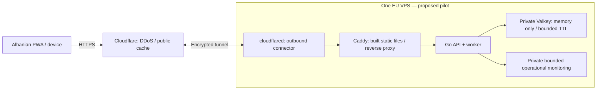

# Deployment preparation and scaling priorities

Date: 2026-09-13; implementation update 2026-09-14. **No public deployment.**
The original priorities below remain the design rationale. Implemented locally:
bounded rank-cursor snapshots, changed-cell refresh with periodic reconciliation,
binary reachability membership, deadline monitoring, API/worker roles, production
Caddy/Compose and an isolated two-replica browser/security rehearsal. See the
[measured results](reports/scaling-2026-09-14.md) and [release runbook](DEPLOYMENT.md).
Full candidate planning, open-gathering refresh and publication still contain linear
work; geographic partitioning, incremental destination indexing and streaming
publication remain conditional future optimizations, not claimed completed work.
Current monitored 100k traffic meets its tested targets without those additions.
Ready to plan deployment and prepare a limited pilot; public launch still requires
the gates below. No purchase, remote push or public deployment is authorized by
this discussion. Current evidence: [automated checks](reports/predeployment-automation.md),
[architecture and memory estimates](ARCHITECTURE.md), [progress](PROGRESS.md).

## 1. Optimize work before adding machines

Keep Go, private memory-only Valkey and the existing spatial grid. A different
database will not fix application-level full-population work. At present:

| Code / behavior | Proposed improvement | Required evidence |
| --- | --- | --- |
| `store.EligibleSnapshot` pages the global expiry sorted set with increasing OFFSET, then retains all signals | Replace offset traversal with bounded cursor traversal, handling duplicate expiry scores and concurrent changes; retain atomic eligibility checks | Equal-score, cancellation/expiry/reinsert and retry tests; scan work versus population |
| `worker.Engine.Step` consumes one global dirty flag and repeatedly scans the population; `Planner.Propose` rebuilds/sorts candidate input | Maintain expiring eligibility indexes by existing private cell and radius; enqueue affected geographic neighborhoods plus timer deadlines; reuse candidate summaries within a pass | Seeded comparison against existing behavior, radius/availability boundaries, oldest-cohort fairness, nearest shared crossroad, no lost wakeups |
| `Planner.Offer` searches all open gatherings; replicas refresh the full open set even before checking matching leadership | Index gatherings by reachable geography; refresh bounded/versioned changes; preserve live revalidation on admission | Late joining, cross-cell destinations, gathering removal/deadlines, decline and stale-cache tests |
| Publication captures all participants into a slice and deduplication map | First measure capture time and memory; then stream expiry-aware aggregation if necessary; consider atomic private counters only if their complexity is justified | Same suppression/buckets, record-consistent states, expiry during capture, no incomplete or stale release |
| Cleanup has a fixed per-tick work budget | Measure oldest overdue index work; give cleanup a bounded adaptive budget and deadline queue | Synchronized expiry, sustained churn, memory/index recovery and API responsiveness |
| Geographic reachability tables are constructed separately in each Go process | Profile table size/copies; use compact immutable structures and avoid unnecessary rebuilds | Same reachability decisions, startup and steady RSS per replica |

Increasing-offset sorted-set paging can add roughly quadratic traversal work over
a complete sweep with fixed page size. [Valkey documents the large-offset cost](https://valkey.io/commands/zrangebyscore/).
Removing OFFSET alone still leaves an O(N) population sweep; it is an intermediate
fix, not the final local-matching design.

The steady-state goal is work proportional to changed neighborhoods and nearby
candidates, rather than all signals in the city. Coarse-cell indexes must still
find people in different cells who can reach the same crossroad: querying only the
changed cell or a fixed adjacent ring is incorrect with larger travel radii.
Derive coverage from configured radii and the existing exact reachability rules.
Bound dense-hotspot work with resumable, fair queues; do not silently truncate
eligible people or change the selected shared destination. Periodic bounded full
reconciliation and aggregate release construction may remain O(N). Processing a
million simultaneous changes necessarily costs more than processing one.

Every new index, queue, lease and temporary summary needs expiry, cleanup and a
documented memory budget. Native key TTL does not clean up sorted-set members or
decrement aggregate counters. Dirty work needs versioned acknowledgement so a
concurrent change cannot be erased by completion of older work.

## 2. Workers and load balancing

Start with one API/worker process and one Valkey on one host. For the next stage,
support explicit API-only and worker roles in the same binary/codebase, and put
two API replicas behind Caddy's local reverse proxy. Preserve a bounded spatial
view for private offers in API-only mode. Shared temporary capabilities and
atomic store transitions should allow requests to move between replicas; verify
this rather than requiring sticky sessions. Keep shared rate/admission budgets.

The present global matching lease means additional processes do not multiply
matching throughput. After incremental scheduling is correct, parallelize
independent geographic work with bounded concurrency, explicit ownership and
fencing checked at mutation time. Gatherings spanning partition boundaries must
have one authoritative owner; retries or expired leases must never double-reserve
participants, activate competing gatherings or count arrivals twice.

Only add a separate API host/load-balancer service when CPU, tail latency or
availability measurements justify it. Two processes on one host help process
restarts but do not survive host loss. One Valkey remains a shared bottleneck and
failure point. Live-state loss on restart remains an explicit product behavior.
Do not enable persistence/backups to mask that property.

Valkey Cluster is not a configuration-only upgrade: current Lua transitions touch
several keys without a shared hash slot. Cross-key transactions require deliberate
data ownership, boundary handling and compatible key placement; see the
[cluster specification](https://valkey.io/topics/cluster-spec/).
Defer clustering, Kubernetes and additional databases until measured need.

## 3. Recommended first deployment topology

Use a named account-managed tunnel for the production hostname, not a temporary
TryCloudflare URL. [Tunnel uses outbound connections](https://developers.cloudflare.com/cloudflare-one/networks/connectors/cloudflare-tunnel/),
so public inbound web ports can remain closed. Keep Caddy/API reachable only on
the necessary private container networks, Valkey on its private backend network,
and monitoring off the public interface. Administration uses SSH keys over a
restricted management path. This hides a directly reachable origin from ordinary
visitors; it does not hide it from the hosting provider or Cloudflare.

The tunnel terminates on the same host as Caddy. Use an isolated local connection
for that final hop, or verify the origin certificate if HTTPS is used; do not
disable verification. A future direct Cloudflare-to-Caddy HTTPS alternative needs
Full (strict), origin firewall restrictions and origin authentication. Full
(strict) alone does not prevent direct-origin bypass or authenticate one's own zone.

### Required proxy and cache implementation

- Current `signalAPI.authorized` uses `RemoteAddr` and deliberately ignores
  forwarded headers. Behind a proxy this shares network limits between unrelated
  users. Add an explicit trusted-proxy mode: accept the canonical client address
  only through our isolated connector/Caddy chain; strip or overwrite spoofable
  inputs at that boundary. Preserve the public Host for origin validation.
- Keep raw IPs out of application logs/storage; use the existing rotating network
  HMAC and TTL budgets. Test untrusted direct peers, spoofed/duplicate headers,
  missing addresses, IPv4/IPv6, multiple clients and shared mobile carrier NAT.
  [Cloudflare's header documentation](https://developers.cloudflare.com/fundamentals/reference/http-headers/)
  explains `CF-Connecting-IP` and Worker caveats. Do not trust arbitrary `X-Forwarded-For`.
- Allowlist cacheable public routes and static assets. Bypass shared caching for
  Authorization/Cookie requests, private endpoints and mutations. Respect public
  release validity and configuration versions; prohibit serving expired releases
  through stale caching or outage fallback. Test the actual edge behavior.
- Cloudflare [does not cache JSON by default](https://developers.cloudflare.com/cache/concepts/default-cache-behavior/).
  Configure the canonical public activity route explicitly; do not enable caching
  indiscriminately across `/api`. Cache rules must preserve query rejection and
  never turn a private response into a public cache entry.
- Combine edge DDoS/WAF protection with application admission budgets, bounded
  execution and overload responses. Free-plan rate limiting currently has one
  IP-based rule and restricted expressions; it is not a replacement for precise
  shared application budgets. [Current limits](https://developers.cloudflare.com/waf/rate-limiting-rules/).

Do not add browser analytics, session replay or fingerprinting/challenge SDKs by
default. Review edge-injected scripts, challenges, cookies and available logging
controls against the documented privacy contract before enabling them. Edge
providers' internal security processing remains a trust boundary even if GATI
does not enable request logs. Test Albanian error handling for edge blocks and
real device location on the final HTTPS hostname.

## 4. Cost and anonymity boundaries

Sizing proposal: start by benchmarking an EU VPS with 4 vCPU and 8 GiB RAM. This
is a pilot candidate, not demonstrated capacity for 100k or 1M on that hardware.
Current local Valkey settings (128 MiB maxmemory, 256 MiB container limit) are
development settings; derive production store/process limits from representative
peaks, fragmentation and OS/worker headroom, with no eviction and fail-closed
admission. Retain a tested signal cap rather than raising it because RAM is free.

Budget approximately **EUR 15–40/month plus the domain** for a modest single-host
pilot, depending on stock, tax and chosen CPU tier. This is a planning allowance,
not a vendor quote or a million-signal service budget. For a concrete lower-cost
reference, Hetzner lists CX33 (4 vCPU, 8 GB) at EUR 8.49/month before VAT/IPv4 in
its June 2026 price table, but its public product page currently marks that tier
unavailable. Check actual regional availability and checkout pricing before any
purchase. [Specifications](https://www.hetzner.com/cloud/cost-optimized/),
[price table](https://docs.hetzner.com/general/infrastructure-and-availability/price-adjustment/).

Cloudflare Free lists CDN, TLS and unmetered DDoS protection; start there and add
a paid tier only for an identified control or operational need. Free is not an
uptime guarantee. [Plan comparison](https://www.cloudflare.com/plans/).
Reserve a separate, temporary staging/testing budget and monitor transfer and
resource costs; do not buy managed databases or load balancing for the initial host.

Three different anonymity goals must be distinguished:

1. **Participants from the public:** retain coarse input, expiring capabilities,
   delayed bucketed cell maps, optional push and the documented inference limits.
2. **Operator from ordinary visitors:** use a project identity/contact, review
   public Git author/email history and artifact metadata before publishing, and
   choose a domain with suitable registration privacy. Do not rewrite existing
   Git history without authorization. [WHOIS redaction](https://developers.cloudflare.com/registrar/account-options/whois-redaction/)
   hides many public fields, but Cloudflare retains the underlying registration
   data; state/country remain public under its documented policy.
3. **Participants/operator from providers:** this deployment does not achieve it.
   [Hetzner account creation](https://docs.hetzner.com/general/billing-and-account-management/account-getting-started/)
   requires contact and billing details. Cloudflare terminates browser HTTPS and
   can see IPs, timing, coarse-cell submissions and temporary authorization
   capabilities. This follows from the [TLS proxy architecture](https://developers.cloudflare.com/ssl/origin-configuration/ssl-modes/full-strict/);
   encryption on both legs does not make the proxy blind. Host administrators can
   inspect live process memory. Provider-side retention is not controlled by GATI TTL.

If hiding application contents from the edge provider is essential, evaluate a
host with network-layer DDoS filtering and direct browser-to-origin TLS instead.
That changes the protection and origin-exposure tradeoffs and needs a separate
provider assessment. Neither option proves anonymous billing or honest hosting.

## 5. Proposed incremental commits and release sequence

| Order | Reviewable result | Validation / boundary |
| --- | --- | --- |
| 1 | Direct matching, release and cleanup lag metrics; representative mixed-load baseline | Fixed-cardinality private metrics; no cell/session/IP labels; 100k distribution and hotspot, mass joins and synchronized expiry; report accepted traffic and resource peaks |
| 2 | Bounded traversal without growing OFFSET; reuse candidate work within a sweep | Equal-score/churn regressions, race detector and same seeded gathering behavior; compare scan work and latency |
| 3 | Expiring cell/radius eligibility, gathering lookup and versioned dirty/deadline queues | Preserve continuous timing, nearest shared crossroad, late admission and cancellation; differential scenarios and queue recovery; rerun privacy tests |
| 4 | API/worker roles and two-replica reverse-proxy lab | Shared limits, replica switching, stale owners, retries, no duplicate activations/arrivals; add parallel geographic ownership only if the single worker still misses measured targets |
| 5 | Production images/Compose/Caddy and trusted proxy boundary; documented edge rule template | Built web assets rather than Vite dev server; spoof/cache/origin tests; enforced no persistence/swap/core dumps/request logs; private ACLs and bounded resources; no provider credentials required for local preparation |
| 6 | Deploy/verify/rollback scripts and private monitoring alerts | Immutable release/config hashes, source/dependency manifest, two clean builds, no simulation routes; private readiness/release-freshness/worker-backlog checks; secrets excluded from output and artifacts |
| 7 | Provider-host staging and small human pilot | Requires selected domain/provider and interactive credentials; remote/public actions need explicit authorization; exercise real TLS/edge/cache, devices, optional push, rollback and destination usability |

Do not delay a safely capped small pilot merely to finish 1M-scale partitioning.
Use baseline measurements to decide which performance changes are necessary at
the intended pilot cap. Trusted proxy/cache handling and actual host privacy
controls are required regardless of scale. A large public launch additionally
needs realistic 30–120 minute full-API churn, an overnight run, combined traffic,
mass admission/expiry and foreground notification/matching latency measurements.
Load-test only authorized targets within provider terms; no improvised DDoS test.

Extend existing monitoring with bounded errors/rate rejections, memory pressure,
oldest matching/deadline work, cleanup backlog, expected public-release freshness,
tunnel reachability and certificate/provider failures. Keep detailed operational
counts private. Use voluntary human feedback for usability; do not add per-user
journey tracking. Alert routing requires an operator-chosen private destination.

Before public launch, publish source/license, schema, effective nonsecret config,
build hashes, dependency/map provenance, data flow, provider exposure and audit
instructions. Compare served browser assets independently and inspect host/image
digests with privileged access. A remote version endpoint cannot prove the backend
is honest. Preserve deployable releases and encrypted operational secrets for
recovery, but never back up participant state. Rollbacks must handle config/schema
compatibility and stale browser caches; a deliberate store reset loses live sessions.

Next: finish release-artifact/rollback verification, then provision an authorized
staging host and real edge rules. Provider credentials, domain choice and the
acceptable provider-visibility boundary are required for that external stage.
