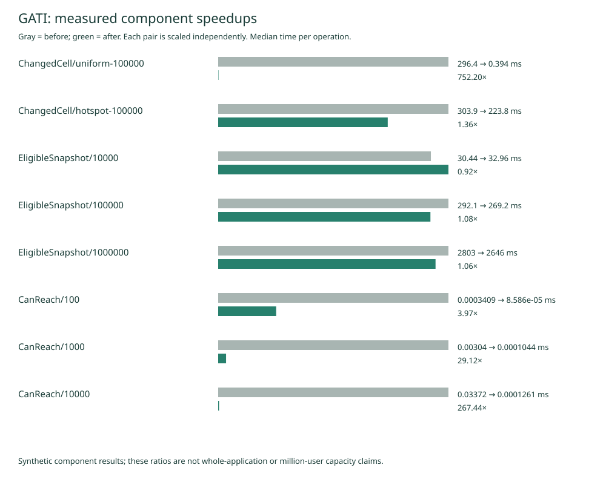

# Measured scaling changes — 2026-09-14

Compared unchanged backend **f9a412e** with **96db982**, built from clean Git
exports. Same AMD Ryzen 7 7435HS (8 cores / 16 threads), Linux x86_64, pinned
Go 1.27.1 and Valkey 9.1.2; generator and services on the same laptop. Functional
config hash `13aedb29ea15f34e845cd4234e124d1047397fc1cfc631d4fb162cbdf51503aa`.
Benchmarks ran sequentially. These are local measurements, not VPS or 1M-user
capacity certification. The original ZSCAN prototype was rejected after making
snapshots 10–20% slower despite reducing allocation traffic.

## Component comparison

Three samples of three iterations for store benchmarks; five samples for
reachability. Values below are medians. Raw samples and observed ranges are in
[the retained evidence](scaling-2026-09-14/comparison.json); ranges are not
confidence intervals. B/op is allocation traffic, not resident memory.

| Work | Before | After | Result |
| --- | ---: | ---: | --- |
| One changed-cell read, 100k distributed across Tirana | 296.38 ms | 0.394 ms | 752× faster database refresh component |
| One changed-cell read, all 100k in one cell | 303.88 ms | 223.78 ms | 1.36× faster |
| Full snapshot, 10k signals | 30.44 ms | 32.96 ms | **8.3% slower** |
| Full snapshot, 100k signals | 292.06 ms | 269.20 ms | 1.085× faster; 43.2% less allocation traffic |
| Full snapshot, 1M signals | 2.803 s | 2.646 s | 1.059× faster; 43.1% less allocation traffic |
| Reachability last-hit/miss, 100 candidates | 341 ns | 86 ns | 3.97× faster |
| Reachability last-hit/miss, 1,000 candidates | 3,040 ns | 104 ns | 29.1× faster |
| Reachability last-hit/miss, 10,000 candidates | 33,724 ns | 126 ns | 267× faster |



Changed-cell measurements compare the old full snapshot plus cell filtering with
the new existing-cell-index read. They exclude materializing the cached population,
candidate planning and periodic full reconciliation. Sparse changes benefit much
more than dense cells or city-wide changes. Reachability measures an intentionally
long search, not the average candidate distribution in real matching.

Rank-cursor traversal removes growing sorted-set offsets; binary search changes
reachability membership from O(K) to O(log K). The matching owner refreshes changed
cells and reuses a private, expiring working set. Materializing candidates and
planning still have population-sized work; full reconciliation runs at least every
ten seconds. Publication also retains a full sweep. This implementation does **not**
make all matching O(1), parallelize the matching lease or establish 1M live capacity.

## Whole-service mixed workload

One real-time run per revision with unchanged configured admission limits:
100,000 accepted creations at 300/s; then sequential private/public reads; then
**simultaneous** 66,680 private status reads, 20,000 public origin reads and 1,000
going confirmations over 20 seconds, followed by 1,000 cancellations. Every phase
had zero rejected requests, errors or generator drops; accepted p95 stayed in the
same **<=10 ms** bucket. There is no measured HTTP latency speedup within that
bucket and no throughput-capacity claim from this fixed-rate workload.

| Sampled during the workload | Before | After | Interpretation |
| --- | ---: | ---: | --- |
| API CPU time, excluding startup | 176.42 CPU s | 142.55 CPU s | 19.2% reduction in this run |
| API peak sampled RSS | 505.18 MiB | 559.40 MiB | **10.7% increase** from cache/memory behavior |
| Valkey CPU time | 75.57 CPU s | 75.02 CPU s | Essentially unchanged |
| Valkey peak sampled RSS | 89.47 MiB | 90.25 MiB | Essentially unchanged |

Five-second monitoring samples reported no alerts. Maximum observed matcher,
cleanup and publication deadline-lag buckets were zero, meaning **less than five
seconds at sampled observations**, not proof of zero delay or per-person response
latency. Both measurements include normal publisher activity but cannot align every
wall-clock release boundary. Repetition on target hardware is needed to separate
small effects from run-to-run variance. [Mixed-load evidence and binary hashes](scaling-2026-09-14/mixed-comparison.json).

An earlier run requested mixed traffic but failed to forward the flag to the Go
generator; it provides sequential evidence only. The boundary and phase checks
were corrected, and the two mixed runs above both explicitly verify that phase.

## Behavioral checks and reproduction

`make test`, `make test-store` and the configured 3,000-person Tirana simulation
passed for 96db982. The simulation accepted 3,000 synthetic credentials, observed
1,922 invited actors, 1,562 arrived actors and 44 gatherings; synthetic timing is
not a performance benchmark. Tests cover equal expiry scores, concurrent removal,
bounded cursor retries, cell refresh, cancellation, lost-change reconciliation,
expiry, cache ownership and reachability decisions.

Run with the current harness and pinned environment:

```sh
source scripts/env.sh
REVISION=f9a412e87b6dfd50dba7f49e8ad90817e3f6c43f make benchmark-scaling OUTPUT=reports/local/before
REVISION=96db982cc485affb3670ae170598624b8a725fa0 make benchmark-scaling OUTPUT=reports/local/after
python3 scripts/compare-scaling.py reports/local/before reports/local/after --output reports/local/comparison
python3 scripts/load.py --sizes 100000 --mixed --revision f9a412e87b6dfd50dba7f49e8ad90817e3f6c43f --output reports/local/mixed-before
python3 scripts/load.py --sizes 100000 --mixed --revision 96db982cc485affb3670ae170598624b8a725fa0 --output reports/local/mixed-after
```

These commands create and destroy owned local stores. They must not target live
participant infrastructure. Local full reports remain under reports/local;
sanitized synthetic benchmark samples and summary evidence are committed here.
